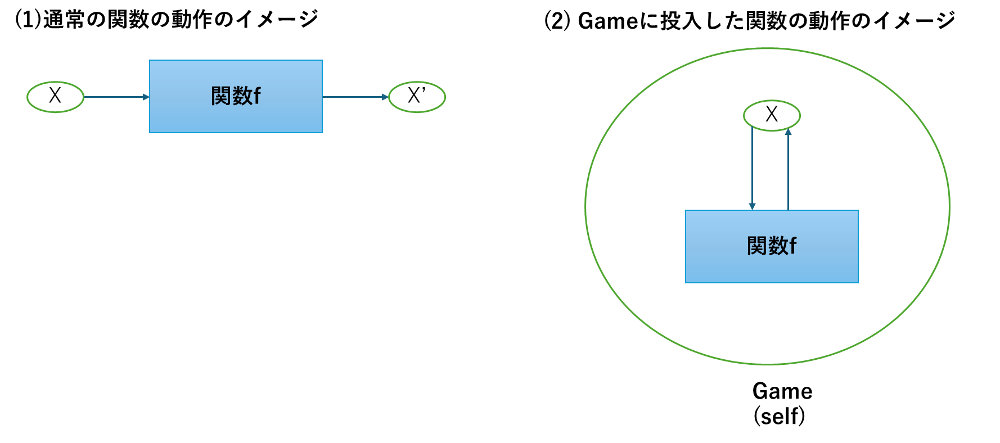

::: callout-note
この章では、**rABM**で用いられている様々なオブジェクトの種類について概観します。**rABM**のオブジェクトには大きく二つのタイプのオブジェクトがあります。

-   フィールドを定義するタイプのオブジェクト：state, act_FUNなど

-   ABMを実行するためのオブジェクト：Game、Series

これらのオブジェクトはすでにここまでのチュートリアルで用いられてきたものですが、この章ではあらためてその仕組みを概観します。さらにこれらのオブジェクトを使用するうえで欠かせない概念である自己参照`self`についても解説します。なお【参考】の項目はややテクニカルな説明となりますので、読み飛ばしていただいても構いません。この章で解説した各種のオブジェクトの使用法は、あとの章で詳述します。つまりこの章は後の各オブジェクトの役割に関する各論に入る前の総論として位置づけられます。
:::

## 3.1 フィールドの定義に関するオブジェクト

### フィールド・カテゴリーの一覧

**rABM**ではそれぞれのオブジェクトを`Game`オブジェクトのフィールドの構成要素として格納する際に、そのオブジェクトがどのような役割を果たす想定で作成されたものなのかを定義する必要があります。**rABM**で使用するフィールド・カテゴリーは以下の5つです。

| カテゴリー | 役割 | 定義用関数 | 投入可能な型 |
|:----------------:|:----------------:|:----------------:|:----------------:|
| state | エージェントの状態を示す | `State()` | 関数以外 |
| active state | エージェントの状態を示す。ただし、他のstateやactive stateに応じて変化する | `Active()` | 関数 |
| act_FUN | エージェントの状態を更新する | `Act()` | 関数 |
| stop_FUN | シミュレーションを終了する | `Stop()` | 関数 |
| plot_FUN | エージェントの状態をプロットする | `Plot()` | 関数 |
| report_FUN | 状態を要約する | `Report()` | 関数 |

この一覧で明らかなように、`state`フィールド以外は投入用のオブジェクトが関数となります。

#### 【参考】定義用の関数の役割

ここまでの事例では、それぞれのオブジェクトを定義用関数でくくってフィールドを定義し、`Game`オブジェクトに格納してきました。この定義用関数が行っている作業は実際には非常に単純で、投入オブジェクトを、`$name`、`$value`、`$category`の三つの要素からなるリストに変換しているだけです。以下の例で実際に確認してみましょう。

```{r}
#| message: false

# ライブラリを読み込んでおく
library(rABM)
```

```{r}
# オブジェクトを作成する
x <- 1

# xをstateフィールドとして定義し、オブジェクトyに付加する
y <- State(x)

# yの構造を見てみる
str(y)

```

つまり、`Game`には実際にはこのリスト化された形式のオブジェクトを投入し、さらに`Game`の内部で追加の処理がされるという仕組みとなっています。したがって原理上、上記の例の場合、`Game(y)`のように投入しても`Game(State(x))`と投入した場合と同じ効果が得られます。

なお、オブジェクトの名前はデフォルトではもとのオブジェクト名が引き継がれるますが、別名を指定することもできます。これは何らかの理由で、元のオブジェクト名を使用したくない場合には便利です。

```{r}
# xではなく、wという名前を指定する
z <- State(x, name = "w")

# zの中身をみてみると、$nameがwに変わっていることが分かる。
str(z)
```

#### 【参考】特殊オブジェクトZip

複数のフィールドオブジェクトをまとめて一つのオブジェクトとするような特殊なオブジェクトとして`Zip`が用意されています。これは通常は使用することはありませんが、何らかの一連のスクリプトを関数化する際には有用です。以下では、`x`と`y`をstateとして定義したオブジェクトをまとめてZipオブジェクト化する例です。

```{r}
x <- 1
y <- 2
z <- Zip(State(x), State(y))
```

このZipオブジェクトは、Gameにそのまま格納できます。Game内部でZipをもとのオブジェクトに仕分ける仕組みがあるからです。つまり以下の二つの例は結果が同じになります。

```{r}
# xとyを定義する
x <- 1
y <- 2

# 通常通りxとyをそれぞれstateとして格納する
G1 <- Game(State(x), State(y))

# いったんZipオブジェクトを作成し、格納する
z <- Zip(State(x), State(y))
G2 <- Game(z)

```

## 3.2 ABMを実行するためのオブジェクト

ABMを実行するためのオブジェクトには、以下の二つがあります。

| オブジェクト | 役割 | 定義用関数 |
|:----------------------:|:----------------------:|:----------------------:|
| Game | シミュレーションの実行 | `Game()` |
| Series | Gameオブジェクトの実行を含む一連のスクリプトをチャンク化し、まとめて実行する | `Series()` |
| Chunk | Seriesオブジェクトを構成するスクリプトの単位 | `Chunk()` |

`Game`はすでに何度も出てきていますが、シミュレーションを実行するための基本単位となるオブジェクトです。**rABM**の核となります。

`Series`は、`Chunk`として分割された一連のスクリプトを一括して実行します。たとえば、実際の分析では「フィールドを設定→シミュレーションの実行→実行結果の取得・分析」という一連の作業を行いますが、複数回のシミュレーションを行う際には、何度も同じスクリプトを書くのは面倒です。そこで、上記の操作をSeriesとして定義してしまうことで、一括して一連の作業をおこなえるようにできます。

## 3.3 自己参照selfの役割

**rABM**においてもっともわかりにくい概念があるとすれば、ここまでの関数でしばしば出てきた自己参照**self**だと思います。この節では**self**について、あまりテクニカルにはならず、rABMを実行する際に必要な限りにおいて必要な点について解説したいと思います。

### (1) 関数のイメージ

通常の**R**の関数は、以下の例のように、外部オブジェクトをインプットとして投入し、何らかの加工を施し、アウトプットを外部に出すように定義されています。

```{r}

# 投入値に1を加える関数
add_1 <- function(x){
  x + 1
}

# 以下の答えは2
add_1(x = 1)
```

一方、rABMで使用する関数は、インプットとアウトプットの対象がGameの内部にあり、かつ関数そのものもGameに組み込まれています。

```{r}
# xの初期値
x <- 1

# 自身のフィールドxに対して1を加える関数
self_add_1 <- function(){
  self$x <- self$x + 1
}

# Gameを定義
G <- Game(State(x), Act(self_add_1))

# self_add_1を実行
G$self_add_1()

# xが2に更新されている
G$x
```

図1　関数の動作イメージの違い

以上の違いをあらためて図示すると図1のようになります。Gameに投入した関数はGameの内部のフィールドxに対して直接働きかけます。この時のGame自身のことがselfと表現されていることになります。

### (2) 実践的なアドバイス

以上がrABMで用いる関数のイメージですが、これだけではなかなかどのタイミングでselfを書くべきなのか、なかなか感覚がつかみにくいと思います。そこで、より実践的に、もっとも単純な工夫をお伝えしたいと思います。それは、自身で関数を書く前に次のようなことを行うことです。

> いったんそこまで作成したGameオブジェクトをself \<- Gと代入したうえで関数を書く

こうすることで、具体的なフィールドを参照しながら関数を書き、テストをすることができます。ごく簡単な例で、このことを順を追って説明します。

はじめにstateに当たるオブジェクトを作成し、いったん含んだGameオブジェクトを作成してしまいます。rABMを実際に使用するにあたって、基本的にはstateから作り始めるのがもっとも容易です。

```{r}
# xを作成する
x <- 1

# xをstateとしてもつGameオブジェクトを作成する
G <- Game(State(x))
```

つぎに、この`G`を仮のオブジェクト`self` に代入します。こうすることで、selfがGと同じフィールドを内部で参照するようになります。

```{r}
self <- G
```

あとは、あらたに`G`に投入したい関数を作成し、`G`に追加します。selfの中身を見れば、何をフィールドと持っているのか直接確認することができるため、関数を格段に作成しやすくなります。

```{r}
# Act用の関数を作成する
self_add_1 <- function(){
  self$x <- self$x + 1
}

# Gに追加する
add_field(G = G, Act(self_add_1))

# 仮に作成しておいたselfを消しておく
rm(self)
```

### 【参考】R6オブジェクト

ここでは、**rABM**を使用するうえで必要な知識に絞って概説的にselfについて説明しましたが、より原理的に知りたい人は、RのR6クラスについて調べてみてください（<https://r6.r-lib.org/articles/Introduction.html>）。`Game`オブジェクトは実はこのR6クラスオブジェクトそのものです。**rABM**はR6クラスの仕組みをABMに応用することで、フレームワークを作っています。
